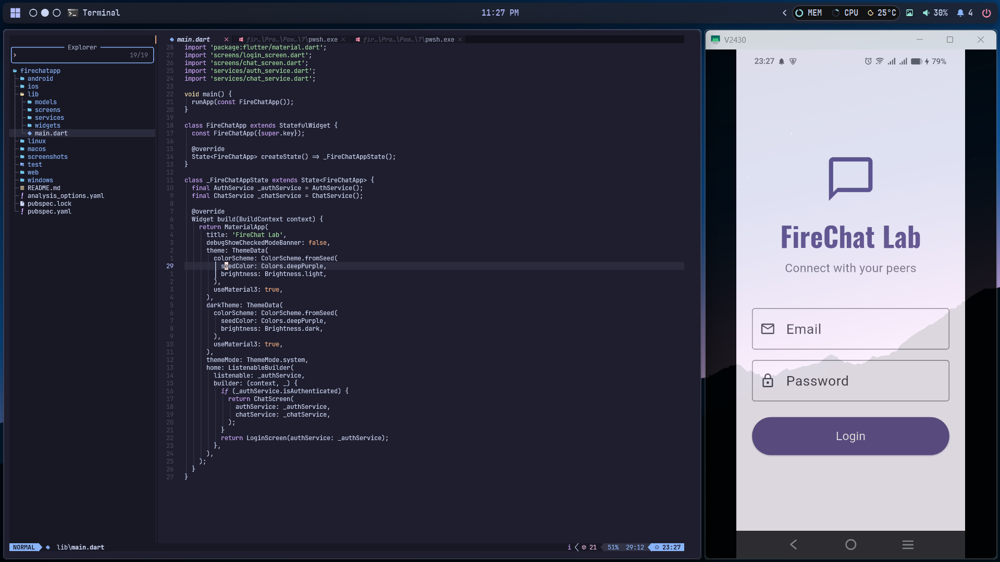
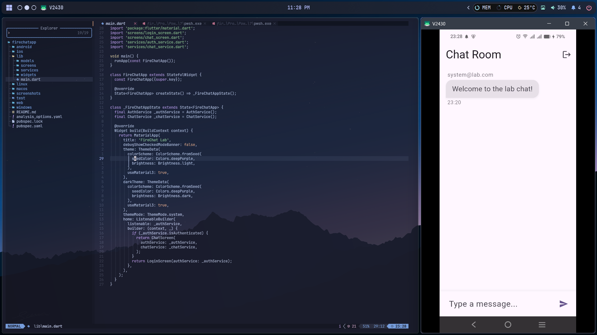

# Firebase Chat Application

> *Note: I've used mock services for this project to demonstrate the UI and application logic without backend dependencies.*

## App Description

This is a simple mobile chat application built with Flutter that provides a real-time messaging environment. It demonstrates the creation of a clean, Material 3-styled chat interface integrated with user authentication flows and message history for laboratory demonstration.

## Key Features

The application includes the following core functionalities:

* **User Authentication:** Provides a login process with email and password, including loading states and session management.
* **Real-time UI:** Uses modern state management to instantly update the UI when new messages are sent.
* **Smart Formatting:** Messages display sender information and timestamps formatted with the `intl` package.
* **Theme Awareness:** Fully supports both Light and Dark modes using Flutter's theming capabilities.

## How the Application Works

The app uses dedicated services to manage the application state and interface with the messaging backend.

1. **Auth Service:** On startup, the app checks the `AuthService` to verify the user's authentication state. It handles secure login and logout operations, notifying the application of state changes.
2. **Chat Service:** The `ChatService` manages the stream of messages, ensuring that the message history is correctly synchronized and updated.
3. **State Management:** The UI listens to these services using `ListenableBuilder`. When a user sends a message, the service processes the request and updates the interface, causing the `ListView` to automatically scroll to the newest entry.

## Screenshots

| Login Screen | Chat Screen | Firestore Console |
| :---: | :---: | :---: |
|  |  |  |

*Note: Please add the screenshot files to the `screenshots/` directory with the names specified above.*
